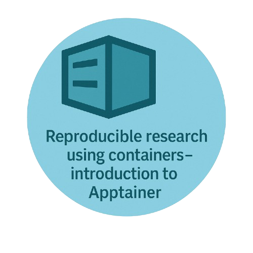
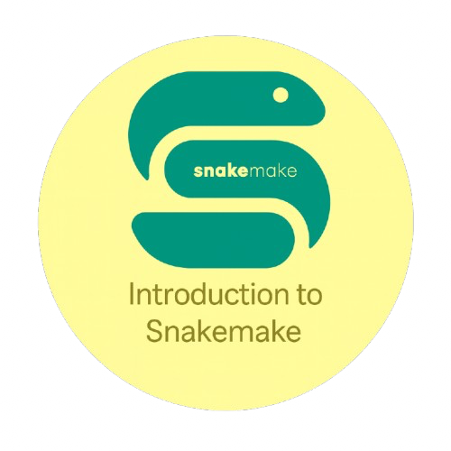

<h1></h1>

 
 
 

!!! quote ""
    
    This catalogue serves as a central repository for training resources and educational materials developed by the Research Computing team at the _Kennedy Institute of Rheumatology, University of Oxford_ to support computational research and skill development. 

    - For any question or enquiries related to this catalogue, please contact KIR Research Computing Manager
    

    _ _ _ 

    ??? circle-info "Additional Training Resources by OxRSE"

        

            
        

        For additional intermediate- to advanced-level Research Software Engineering training resources, as well as selected introductory materials focused on specific programming languages, please refer to the catalogue maintained by [OxRSE](https://www.rse.ox.ac.uk) at https://train.rse.ox.ac.uk/material.

<!--- check -->

---

-   <a href="https://kir-rescomp.github.io/training-intro-to-linux-cli/" style="text-decoration: none; color: inherit; display: block;">
    
{ width="220" }

    
    __Introduction to the Linux Command Line__
    
    ---
     
    Explore the foundations of working efficiently in a Linux environment through the command line interface. This beginner-level workshop introduces essential commands for navigating the filesystem, managing files and processes, and automating tasks
    </a> 

    [Start :octicons-arrow-right-24:](https://kir-rescomp.github.io/training-intro-to-linux-cli/){ .md-button }
    
-   <a href="https://kir-rescomp.github.io/training-intro-to-git-github/" style="text-decoration: none; color: inherit; display: block;">
    
{ width="220" }

    
    __Introduction to Git and Github__
    
    ---
     
    How to manage code and collaborate effectively using Git and GitHub. This workshop introduces version control concepts, repositories, branching, commits, and pull requests, providing the skills needed to track changes and contribute confidently to modern software projects
    </a> 

    [Start :octicons-arrow-right-24:](https://kir-rescomp.github.io/training-intro-to-git-github/){ .md-button }

-   <a href="https://kir-rescomp.github.io/training-intro-to-apptainer/" style="text-decoration: none; color: inherit; display: block;">
    
{ width="220" }

    
    __Introduction to Apptainer__
  
    ---
     
     
    Introduction to using the Apptainer container platform. Apptainer is particularly suited to running containers on infrastructure where users don’t have administrative privileges, for example shared infrastructure such as High Performance Computing (HPC) clusters
    </a> 

    [Start :octicons-arrow-right-24:](https://kir-rescomp.github.io/training-intro-to-apptainer/){ .md-button }
    
-   <a href="https://kir-rescomp.github.io/training-intro-to-snakemake" style="text-decoration: none; color: inherit; display: block;">
    
{ width="220" }

    
    
    __Introduction to Snakemake__
    
    ---
    
    Snakemake is a powerful workflow management system designed to create reproducible and scalable data analyses through simple, human-readable Python-based syntax. It automatically detects dependencies, parallelizes tasks efficiently, and can seamlessly scale from a single workstation to computing clusters and cloud environments
    </a> 
    
    [Start :octicons-arrow-right-24:](https://kir-rescomp.github.io/training-intro-to-snakemake/){ .md-button }

-   <a href="https://kir-rescomp.github.io/training-gpu-profiling/" style="text-decoration: none; color: inherit; display: block;">
    
{ width="220" }

    
    
    __GPU Profiling__
    
    ---
     
    
    User-level guide for profiling GPU usage in Slurm jobs without requiring sudo/admin permissions.
    </a> 
    
    [Start :octicons-arrow-right-24:](https://kir-rescomp.github.io/training-gpu-profiling/){ .md-button }

-   <a href="https://kir-rescomp.github.io/training-basics-python-packaging/" style="text-decoration: none; color: inherit; display: block;">
    
{ width="220" }

    
    
    __The Basics of Python Packaging__
    
    ---
    
    Quick how-to guide on what you minimally need to do to adopt the modern Python packaging standards
    </a> 
    
    [Start :octicons-arrow-right-24:](https://kir-rescomp.github.io/training-basics-python-packaging/){ .md-button }

    

