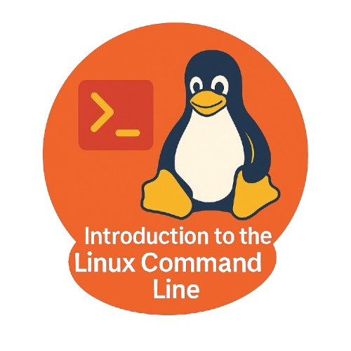

<h1 align="center"><b>KIR Training Catalogue</b></h1>

 
 
 

<!--- check -->

---

-   
{ width="220" }

    
    __Introduction to the Linux Command Line__
    
    ---
    
    Explore the foundations of working efficiently in a Linux environment through the command line interface. This beginner-level workshop introduces essential commands for navigating the filesystem, managing files and processes, and automating tasks
    
    [Start :octicons-arrow-right-24:](./aws/){ .md-button }
    
-   
{ width="220" }

    
    __Introduction to Git and Github__
    
    ---
    
    How to manage code and collaborate effectively using Git and GitHub. This workshop introduces version control concepts, repositories, branching, commits, and pull requests, providing the skills needed to track changes and contribute confidently to modern software projects
    
    [Start :octicons-arrow-right-24:](./azure/){ .md-button }

